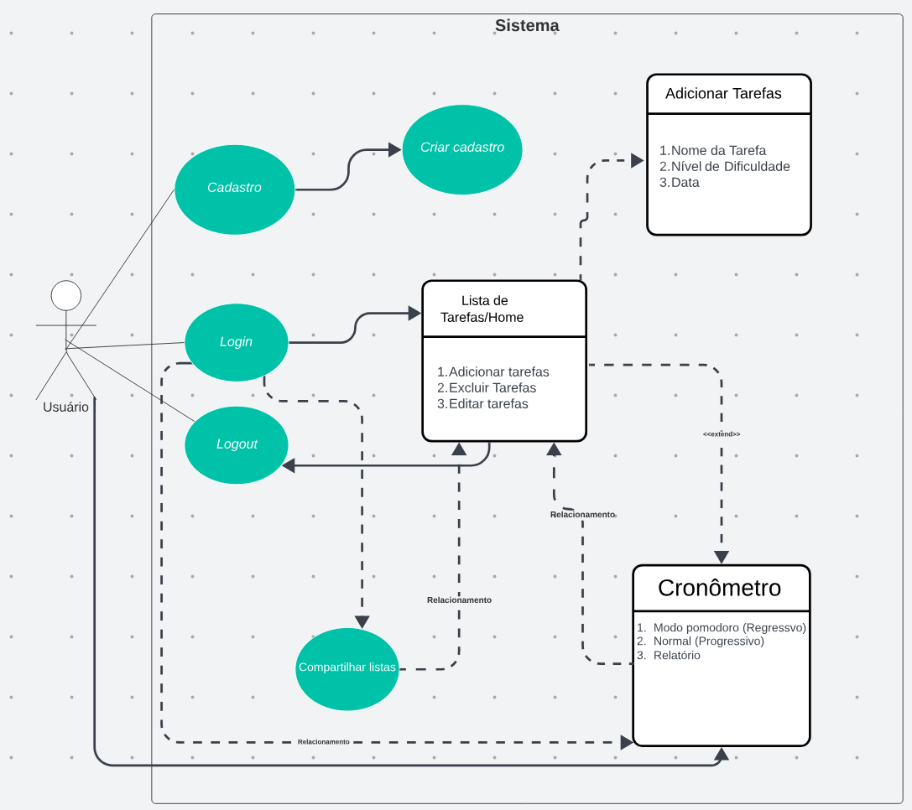

# Especificações do Projeto

A determinação exata do problema, suas personas, requisitos funcionais e não-funcionais foram acordadas em reuniões online entre os membros da equipe. Foram reunidas informações e observações e, complementarmente. Os detalhes levantados nesse processo auxiliaram na construção de personas e histórias de usuários.

## Personas

<table>
  <tr>
    <th colspan=2>Thaissa Teixeira - 22 anos</th>
  </tr>
  <tr>
    <td>
          
    </td>
    <td>
      

        Estudante de Gerência de RH, Thaissa já atua como "Tech Recruiter", entrevistando diversas pessoas para preencher posições vagas em empresas.
        Para tornar o processo de entrevista mais simples e organizado, ela busca um app onde ela pode criar uma "checklist" com sub listas, e reutiliza-la para cada entrevistado.
      

    </td>
  </tr>
  <tr>
    <th colspan=2>Kaleb Fraga - 24 anos</th>
  </tr>
  <tr>
    <td>
          
    </td>
    <td>
      

        Futuro diretor cinematográfico, Kaleb é graduando em um curso de Cinema.
        Para dar conta de ler todos os artigos e obras necessárias para seu TCC, Kaleb pensa em utilizar o<b style="color:lightblue"> método do pomodoro</b> e busca um app para auxilia-lo.
      

    </td>
  </tr>
  <tr>
    <th colspan=2>Vinicius Santos - 54 anos</th>
  </tr>
  <tr>
    <td>
          
    </td>
    <td>
      

        Vinicius Santos é autônomo em uma indústria não convencional, e nós não precisamos de detalhes sobre isso, o que importa é que ele precisa de um aplicativo com uma lista para gerenciamento de tarefas e de um cronômetro.
      

    </td>
  </tr>
  <tr>
    <th colspan=2>Thamara Munhoz - 26 anos</th>
  </tr>
  <tr>
    <td>
          
    </td>
    <td>
      

        Autodidata e Desenvolvedora de Software freelancer, Thamara precisa de uma lista para gerenciar os projetos em que trabalha, bem como contabilizar quanto tempo gastou em cada projeto.
      

    </td>
  </tr>
  <tr>
    <th colspan=2>Jéssica Boscatti - 32 anos</th>
  </tr>
  <tr>
    <td>
          
    </td>
    <td>
      

        Gerente de projetos, Jéssica trabalha com múltiplas equipes desenvolvendo produtos para diversos clientes da empresa em que trabalha.
        Para não se perder entre os assuntos dos projetos nas reuniões, ela pensou em utilizar um aplicativo para listar os projetos e <b style="color:lightblue">adicionar tópicos com detalhes</b> de cada um.
      

    </td>
  </tr>
</table>

## Histórias de Usuários

| EU COMO... `PERSONA` | QUERO/PRECISO ... `FUNCIONALIDADE`                                                                 | PARA ... `MOTIVO/VALOR`                                                                                |
|----------------------|----------------------------------------------------------------------------------------------------|--------------------------------------------------------------------------------------------------------|
| Thaissa Teixeira     | Cadastrar um perfil para acessar as listas de tarefas salvas previamente                           | Reutilizar listas criadas anteriormente em situações semelhantes                                       |
| Kaleb Fraga          | Controlar o tempo gasto em cada tarefa e acompanhar sua produtividade por meio de relatórios       | Gerir o tempo disponível para concluir seu TCC                                                         |
| Vinicius Santos      | Compartilhar suas listas de tarefas com outros funcionários da empresa                             | Aumentar a produtividade da sua empresa                                                                |
| Thamara Munhoz       | Criar listas de tarefas e categorizá-las segundo sua urgência ou complexidade                      | Organizar as demandas diárias do trabalho e evitar atrasos nas entregas para os clientes               |
| Jéssica Boscatti     | Acessar regularmente, por meio de login, as informações nas listas salvas em seu perfil cadastrado | Editar ou excluir os itens já adicionados nas listas e organizar as tarefas em andamento ou concluídas |

## Modelagem do Processo de Negócio 

### Análise da Situação Atual

Na atualidade, o excesso de informação e de estímulos externos dificulta a manutenção do foco na concretização de tarefas diárias. Diversas pessoas chegam ao fim do dia ansiosas e frustradas por não terem conseguido concluir as atividades relacionadas ao trabalho e à vida pessoal.

### Descrição Geral da Proposta

O desenvolvimento de uma aplicação distribuída de gestão de tarefas e de tempo tem como objetivos aumentar a concentração, diminuir a ansiedade e elevar a produtividade e qualidade de vida.
Organizar as tarefas por meio de listas auxilia os indivíduos a terem mais clareza sobre seus objetivos e controlar o tempo otimiza a distribuição do esforço empregado na execução das atividades.
As informações adicionadas pelo usuário serão editáveis, existindo a possibilidade de adicionar ou excluir dados ao longo do tempo.

### Processo Atual 1 – Dificuldade para organizar tarefas diárias

O usuário não consegue organizar de forma apropriada todas as tarefas que precisa de executar e gerir o tempo dedicado a cada uma delas.

### Processo Proposto 1 – Elaboração de uma lista de tarefas por meio da aplicação TaskIt

## Indicadores de Desempenho

|# | Indicador | Objetivos |Descrição|Cálculo|Fonte|Perspectiva|
|--| ----------| ----------|---------|-------|-----|----------|
|01|Número de usuários cadastrados|Aumentar a taxa de crescimento do aplicativo|Avaliar quantos usuários novos cadastram-se por mês|Média do número de usuários cadastrados por mês|Banco de dados do projeto|Aumentar a taxa de crescimento| 
|02|Número de exclusão de contas do aplicativo|Reduzir o número de usuários que deixam de utilizar o aplicativo|Avaliar as mudanças necessárias para evitar futuras exclusões |Média do número de exclusões realizadas por mês| Banco de dados do projeto |Diminuir o número de exclusões| 
|03|Quantidade de tarefas criadas|Aumentar a frequência de uso|Verificar atividade diária dos usuários ativos|Número de tarefas criadas/editadas/excluídas por dia|Banco de dados do projeto|Aumentar o número de tarefas cadastradas |
|04|Tempo de uso| Aumentar a frequência de uso |Verificar por quanto tempo o usuário utilizou o aplicativo|Tempo de uso do timer| Banco de dados do projeto |Aumentar o tempo de uso| 
|05|Taxa de erros|Diminuir quantidade de falhas que o aplicativo apresentou|Percentual de solicitações que resultam em  erros ou falhas|Quantidade de falhas que o aplicativo apresentou por mês|Testes do sistema|Corrigir e verificar as falhas|

## Requisitos

As tabelas que se seguem apresentam os requisitos funcionais e não funcionais que detalham o escopo do projeto. Para determinar a prioridade de requisitos, aplicar uma técnica de priorização de requisitos e detalhar como a técnica foi aplicada.

### Requisitos Funcionais

A tabela a seguir apresenta os requisitos do projeto, identificando a prioridade em que os mesmos devem ser entregues. 

| ID     | Descrição do Requisito                                                                                          | Prioridade |
|--------|-----------------------------------------------------------------------------------------------------------------|------------|
| RF-001 | O software deve permitir que o usuário crie uma lista de tarefas.                                               | ALTA       |
| RF-002 | O software deve permitir o cadastro de usuários.                                                                | ALTA       |
| RF-003 | O software deve permitir o login e logout.                                                                      | ALTA       |
| RF-004 | O software deve apresentar um timer para o controle de tempo.                                                   | MÉDIA      |
| RF-005 | O software deve permitir que o usuário organize suas tarefas utilizando as categorias urgente, difícil e fácil. | MÉDIA      |
| RF-006 | O software deve gerar um relatório comparando o tempo gasto com o tempo planejado.                              | BAIXA      |
| RF-007 | O software deve permitir o compartilhamento das listas.                                                         | BAIXA      |

### Requisitos não Funcionais

A tabela a seguir apresenta os requisitos não funcionais que o projeto deverá atender.

| ID      | Descrição do Requisito                                                                                                                  | Prioridade |
|---------|-----------------------------------------------------------------------------------------------------------------------------------------|------------|
| RNF-001 | A aplicação deve ser publicada em repositório público acessível na internet (Repl.it, GitHub Pages etc.).                               | ALTA       |
| RNF-002 | O site não apresentará aos usuários quaisquer dados de cunho privativo e deverá atender às normas legais, tais como padrões LGPD e etc. | ALTA       |

## Restrições

As questões que limitam a execução desse projeto e que se configuram como obrigações claras para o desenvolvimento do projeto em questão são apresentadas na tabela a seguir.

| ID    | Restrição                                                                                                                                      |
|-------|------------------------------------------------------------------------------------------------------------------------------------------------|
| RE-01 | O projeto deve ser entregue até 10/12/2023.                                                                                                    |
| RE-02 | A equipe não pode subcontratar o desenvolvimento do trabalho.                                                                                  |
| RE-03 | O projeto utiliza as linguagens HTML, CSS, JavaScript e React, para que os usuários possam visualizar e interagir com o site na versão mobile. |

## Diagrama de Casos de Uso

O Diagrama de Casos, conforme ilustrado abaixo, serve para permitir uma melhor representação visual entre o usuário e o sistema, baseado nos requisitos funcionais do sistema.

# Matriz de Rastreabilidade

| &nbsp;     | RF-01 | RF-02 | RF-03 | RF-04 | RF-05 | RF-06 | RF-07 | RNF-01 | RNF-02 | RE-01 | RE-02 | RE-3 |
|------------|-------|-------|-------|-------|-------|-------|-------|--------|--------|-------|-------|------|
| **RF-01**  |       | ❌     | ❌     |       |       |       |       |        | ❌      | ❌     | ❌     | ❌    |
| **RF-02**  |       |       |       |       |       |       |       |        | ❌      |       |       |      |
| **RF-03**  |       | ❌     |       |       |       |       |       |        | ❌      |       |       |      |
| **RF-04**  |       | ❌     | ❌     |       |       |       |       |        | ❌      |       |       |      |
| **RF-05**  | ❌     | ❌     | ❌     |       |       |       |       |        | ❌      |       |       |      |
| **RF-06**  | ❌     | ❌     | ❌     |       |       |       |       |        | ❌      |       |       |      |
| **RF-07**  | ❌     | ❌     | ❌     |       |       |       |       |        | ❌      |       |       |      |
| **RNF-01** |       |       |       |       |       |       |       |        | ❌      |       |       |      |
| **RNF-02** |       |       |       |       |       |       |       |        |        |       | ❌     |      |
| **RE-01**  | ❌     | ❌     | ❌     | ❌     | ❌     | ❌     | ❌     | ❌      | ❌      | ❌     | ❌     | ❌    |
| **RE-02**  |       |       |       |       |       |       |       |        | ❌      | ❌     |       |      |
| **RE-03**  |       |       |       |       |       |       |       |        | ❌      | ❌     | ❌     |      |

> **Legenda**:
> 
> - **Coluna vertical**: requisitos funcionais, não funcionais e restrições
> - **Coluna horizontal**: relação de dependências entre os requisitos e restrições

# Gerenciamento de Projeto

Em observação ao cronograma geral dos entregáveis do projeto junto aos requisitos, foi construído um gráfico ilustrando o avanço das diferentes etapas do projeto com as respectivas dependências (gráfico de gantt). Também foi criado uma tabela com estimativa de custos.

## Gerenciamento de Tempo

Para o gerenciamento do cronograma do projeto foi utilizado o método de Gantt. As imagens abaixo mostram: a Tabela de Organização das tarefas, com as datas de início e fim, e, também, com as ordem cronológica a serem executadas; e o diagrama de Gantt, onde trás essa ilustração da tabela.

.png)

## Gestão de Orçamento

O orçamento foi planejado para o tempo estimado de 5 meses, desde o brainstorm até a entrega do produto. Foi levado em consideração os gastos totais e a forma de pagamento desses gastos. Também foi feito uma reserva para gastos emergenciais de 10% dos gastos totais.

